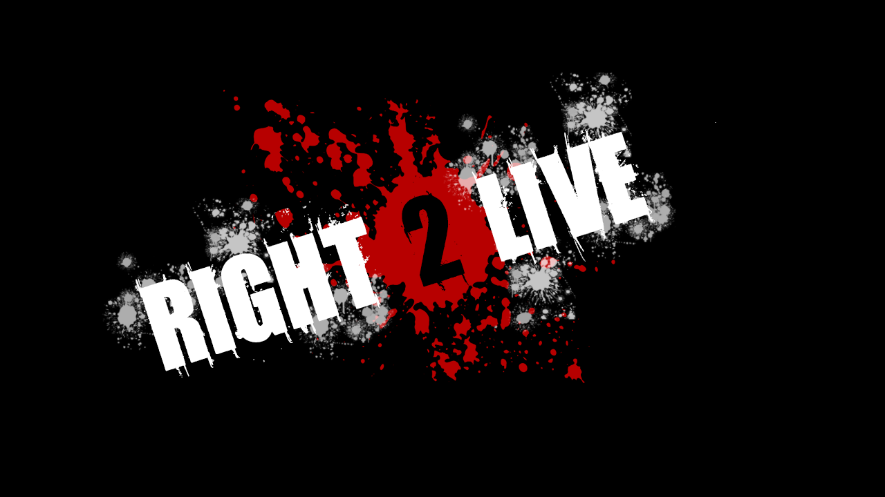

# Right 2 live
### A zombie survival game in which the player chooses one of 3 companions to fight along with
* Ellie
* Zoey
* louis
# The game consists of 3 levels 
* level 1 : a Normal level in which the player has to kill all zombies and reach the end point.
* level 2: a stealth level in which the player has to avoid zombies and get to the end point as the number of zombies is very big.
* level 3: a rescue level in which the player has to save his companion after that a final boss is spawned that must be killed in order to finish the game.
# The final boss has 2 types of attacks
* earthquake attack : the final boss smashes the ground causing the player to take damage if he was not jumping at the moment.
* meteor attack : the final boss charges a super strong meteor after that he throws it at the player if he managed to hit the player, he player takes damage. If the boss missed the meteor smashes the ground causing a spawn of a horde of zombies.

### Notes
- Glitch returning back to MainMenu in Game (Forgot to set Timescale to 1 instead of 0 on button click before building) **Fixed after building** [Commit](https://github.com/guc-met/final-project-right2live/commit/2325ae72c19a5370a9f782c203bf9e73e81e033c#diff-bd12731d7bc9b843d8523e654ae92abe735ee95f0777e46e77ee286b17833acd)

